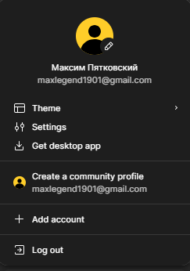

# Lab 1: Overview of Prototyping Services

## Work Process

1. **Create an account in Figma (enter your first and last name).**  
   I registered an account in Figma under the name: Maksym Pyatkovskyi.  
   

2. **Download the desktop version of Figma on your PC or laptop (if possible) and install it.**  
   I downloaded and installed the desktop version of Figma on my laptop. After installation, I opened the program and logged in with my account.  
   

3. **Add a screenshot of the Figma interface with the logged-in account to the report.**  
   I added a screenshot of the Figma interface with the logged-in account to the report, showing a successful login.  
   

## Conclusions

- In practice, I learned how to create a Figma account and use the desktop version of the program.
- This taught me how to quickly register in prototyping services, explore their interface, and make screenshots for documentation.
