# **ПЗ-10 Про компоненти і варіанти у Figma**

## **Мета роботи**

Ознайомитися з принципами створення та використання компонентів у Figma, навчитися працювати з варіантами (Variants), Auto Layout, Component Properties та правилами побудови дизайн-систем. Закріпити отримані знання на практиці шляхом створення власних компонентів із різними станами, розмірами та варіантами.

---

## **Хід роботи**

### 1. **Вивчено теоретичні матеріали про компоненти у Figma**

- Основи створення базових компонентів.
- Поняття вкладених компонентів та організації структури.
- Робота з Auto Layout для створення адаптивних елементів.
- Принципи використання Component Properties (Text, Boolean, Instance Swap, Variant).

### 2. **Переглянуто рекомендовані відеоматеріали**

- _“Figma Components Tutorial”_
- _“Variants and Component Properties in Figma”_  
  Посилання з завдання:
  - https://www.youtube.com/watch?v=sFvMPRAEJQI
  - https://www.youtube.com/watch?v=JJORk40g7AU

### 3. **Опрацьовано принципи створення варіантів компонентів**

- Формування кількох станів у межах одного компоненту через Variants.
- Стандартизація властивостей (Size, Type, State, Color, Icon).
- Налаштування змінних властивостей для зручного редагування екземплярів:
  - Text property
  - Instance swap
  - Variant switching

---

## **4. Практична частина виконана у Figma**

### **4.1. Створено базові компоненти**

- Вікна з напоями з такими параметрами:

  - **Colors:** Red, Yellow, Green, Purple
  - **Sizes:** Small, Big

- Компонент кнопки з двома типами:
  - **Primary**
  - **Secondary**

## 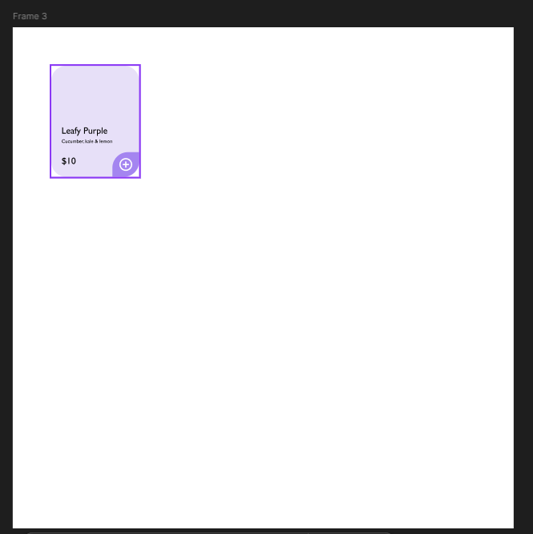

## 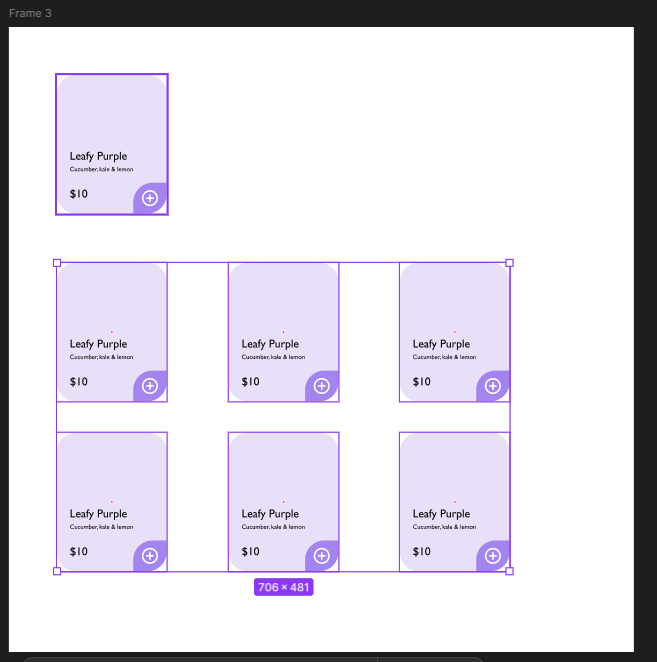

## 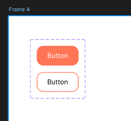

## 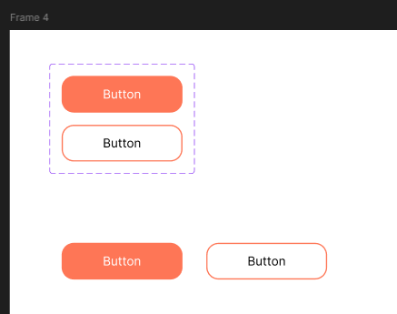

## 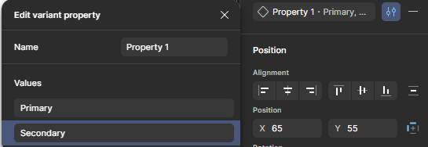

## 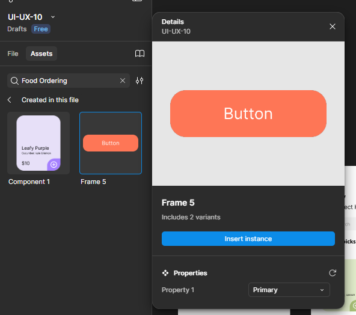

## 

## 

## 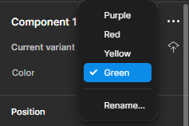

## 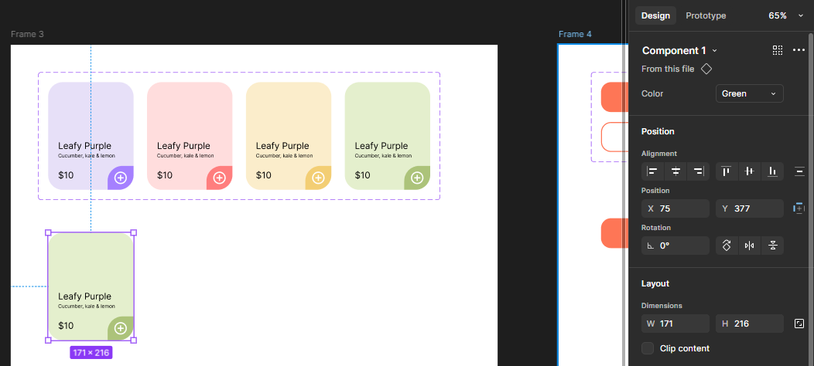

## 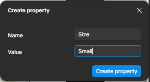

## 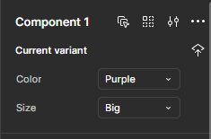

## 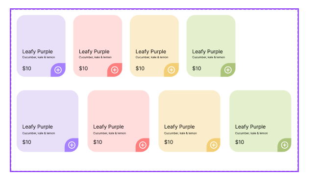

### **4.2. Створено розширений набір кнопок (80 варіантів)**

- **Кольори:** Cyan, Dark Cyan
- **Розміри:** Size1, Size2, Size3, Size4, Size5
- **Тип символів:** Arrows, Dots
- **Позиція іконки (Location):** None, Left, Right, Both

## 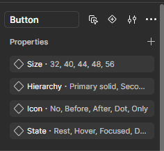

## 

## 

### **5. Сформовано фінальні макети**

Створено фрейм “Components & Variants”, у якому продемонстровано всі компоненти та їх варіанти.

---

## **Результат виконання**

- Створено повноцінну компонентну бібліотеку.
- Реалізовано десятки варіантів компонентів з різними параметрами.
- Продемонстровано вміння працювати з Auto Layout та Component Properties.
- Підготовлено структурований макет для подальшого використання у дизайн-проєктах.

---

## **Фотографії з виконанням завдань**

## 

## 

## 

## 

## 

## 

## 

## 

## 

## 

## 

## 

## 

## 

## 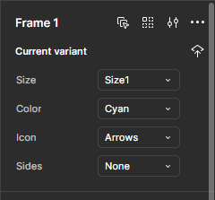

## 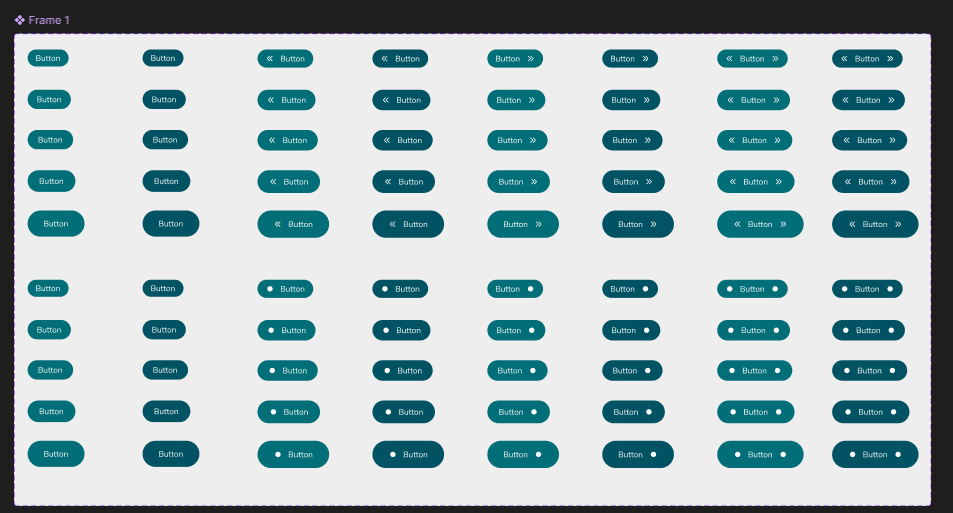

## **Висновки**

У результаті виконання ПЗ-10 було:

- засвоєно принципи побудови компонентів та їх варіантів;
- опановано Auto Layout як інструмент створення адаптивних елементів;
- сформовано композиційно правильну та організовану дизайн-систему;
- отримано практичні навички моделювання компонентів у Figma, які використовуються в реальних UI/UX-проєктах.

---

## **Посилання на Figma-файли з виконаним завданням**

[Переглянути Figma-файл із роботою 1](https://www.figma.com/design/rLViff1i7GBaTRbbqfdW1w/UI-UX-10?node-id=0-1&p=f&t=oLabE8kGzm6vRCpH-0)

[Переглянути Figma-файл із роботою 2](https://www.figma.com/design/rLViff1i7GBaTRbbqfdW1w/UI-UX-10?node-id=12-461&p=f&t=oLabE8kGzm6vRCpH-0)
