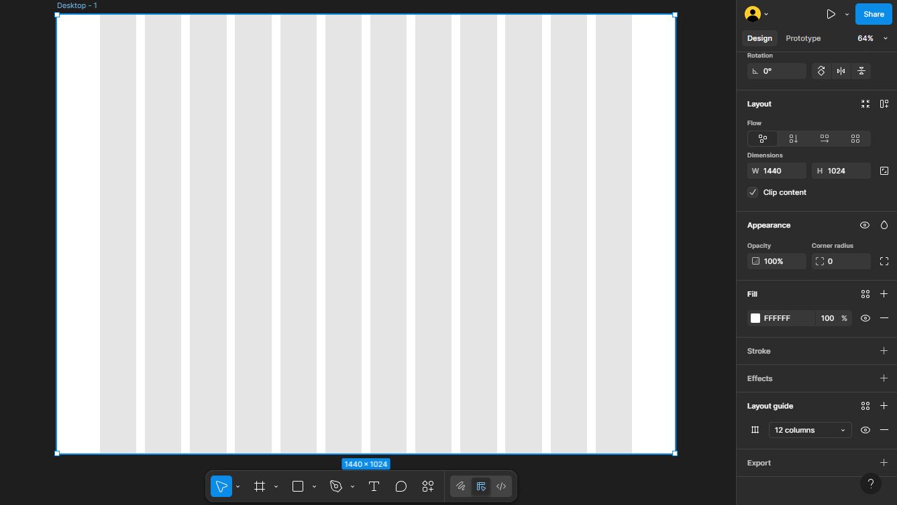
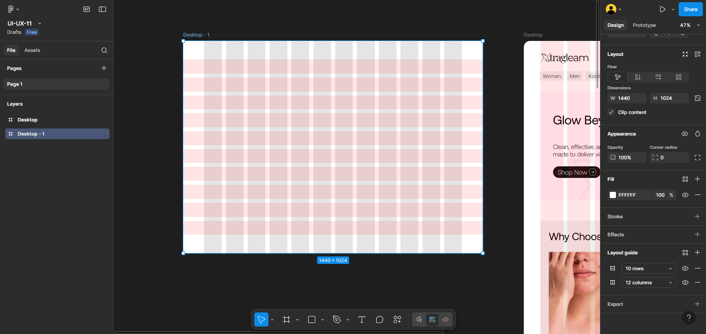
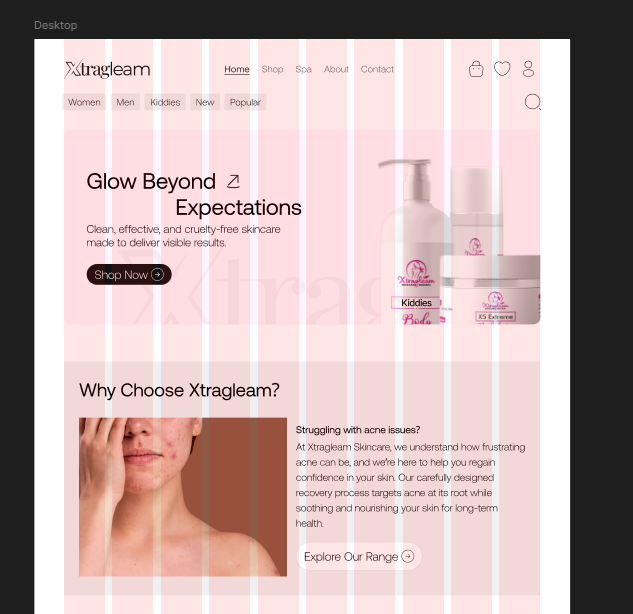

# ПЗ-11 Сітки у дизайні інтерфейсу

## **Мета роботи**

Ознайомитися з концепцією сіток (grid) у веб- та інтерфейсному дизайні, зрозуміти їхні переваги, типи, а також як використовувати сітки для створення гармонійних макетів, які легко адаптуються під різні розміри екранів.

## **Хід роботи**

1. **Перегляд відео**  
   — Переглянуто відео на YouTube, в якому розглядаються сіткові системи у веб-дизайні.  
   — Проаналізовано ключові моменти: структура колонки, модульна сітка, ієрархія, адаптивність.

2. **Читання статті**  
   — Опрацьовано статтю “Використання сітки у вебдизайні” на сайті Armedsoft.
   — Виділено основні ідеї: сітки дозволяють підлаштовувати дизайн під різні пристрої, керувати вирівнюванням, підтримувати візуальну послідовність.

3. **Додаткове вивчення теорії**  
   — Досліджено статтю про типи сіток (модульні, колонкові тощо) та їхні функції.
   — Розглянуто переваги сіток: покращена ієрархія, узгодженість, швидша розробка, адаптивність.
   — Проаналізовано, як сітки впроваджуються в практиці: визначення колонок, відступів, правил вирівнювання.

4. **Практична частина (у Figma чи іншому редакторі дизайну)**  
   — Створено фрейм в Figma.  
   — Застосовано сітку: наприклад, 12-колонкова модульна сітка з відступами та `gutter`, як пораджено в теорії.

## 

## 

## 

## **Висновки**

- Сітки є фундаментальним інструментом в UI/UX-дизайні: вони допомагають створити впорядковані, читабельні та естетично привабливі інтерфейси.
- Використання сітки сприяє покращенню співпраці між дизайнерами та розробниками: чітка структура макета полегшує верстку.
- Адаптивні сітки (responsive grids) дозволяють підлаштовувати дизайн під різні екрани, що особливо важливо в сучасному вебі та мобільних інтерфейсах.
- При цьому сітка не обмежує креативність: вона дає основу, але дизайнери можуть свідомо порушувати сітку для створення акцентів або динамічних композицій.

## **Посилання на ресурси**

- [Стаття «Використання сітки у вебдизайні» (Armedsoft)](https://armedsoft.com/ua/blog/vykorystannya-sitky-u-vebdyzayni)
- [Відео з YouTube](https://www.youtube.com/watch?v=xeEUYFnewrs&authuser=0)

---

## **Посилання на Figma-файли з виконаним завданням**

[Переглянути Figma-файл із роботою](https://www.figma.com/design/azCkcwNgKM9zbW7dqLPZnC/UI-UX-11?node-id=3-4&t=hVqgMuw3jzPlqg4e-0)
