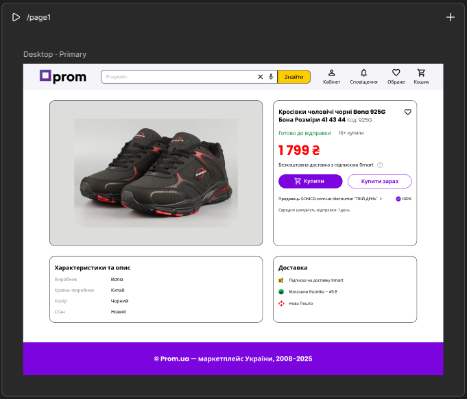
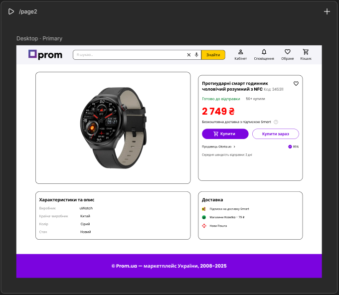
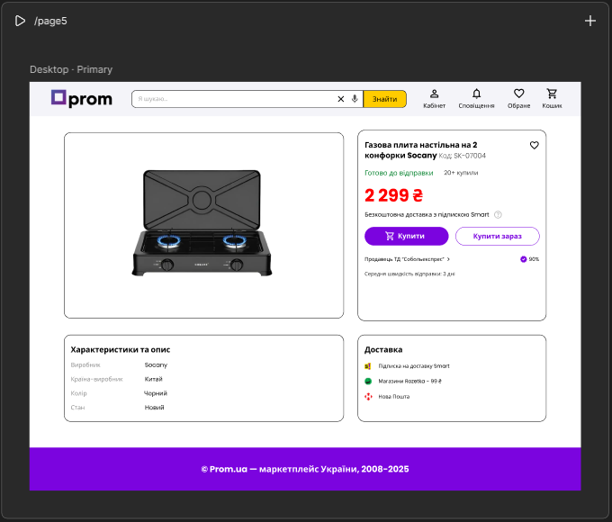
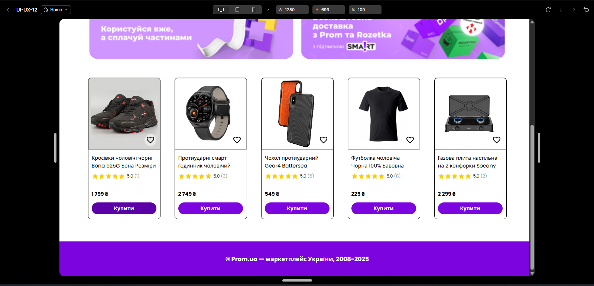
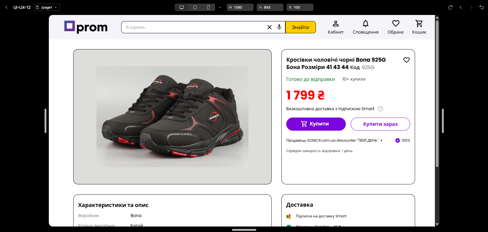
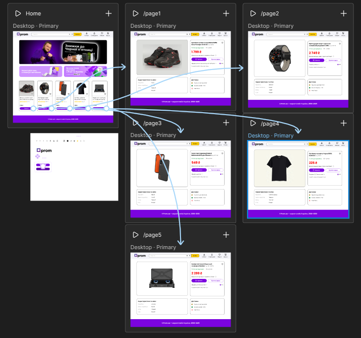
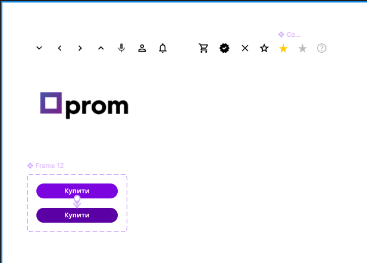
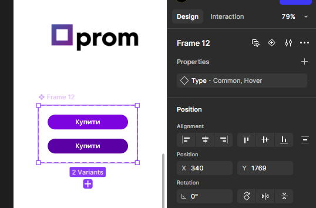

# ПЗ-12 Розробка wireframe

## **Мета роботи**

- Cтворити у Figma деталізований вайрфрейм сайту для інтернет-магазину (головна сторінка та 2-3 сторінки товару). Тематику обрати самостійно. Розмір екранів - desktop.
- Використати інструменти прототипування і зробити клікабельний прототип на основі вайфрейму.

## **Хід роботи**

1. **Вибір тематики магазину.**  
   Обрано тему інтернет-магазину (Prom.ua).

2. **Створення структури сайту.**

   - Головна сторінка
   - Сторінка товару №1
   - Сторінка товару №2
   - Сторінка товару №3
   - Сторінка товару №4
   - Сторінка товару №5

3. **Розробка вайрфреймів у Figma.**

   - Створено desktop-фрейми 1280 px шириною
   - Додано базові елементи інтерфейсу:  
     хедер, футер, меню, карточки товарів, банери, прев’ю товарів

4. **Налаштування взаємодій (Interactions).**  
   Додано такі типи прототипування:

   - **On Click → Navigate To**  
     (переходи між сторінками)
   - **On Hover → Button**  
     (Темніший колір кнопки при ховері)

5. **Створення клікабельного прототипу.**  
   Усі кнопки та карточки товарів пов’язані між собою.  
   Прототип переглянуто через кнопку **Present**.

## **Результат виконання**

У результаті виконання роботи створено:

- деталізований вайрфрейм інтернет-магазину у Figma
- головна сторінка та 5 сторінок товару
- логічна навігація між екранами
- клікабельний інтерактивний прототип із використанням Interactions
- демонстрація роботи магазину на рівні UX-компонування

## **Скріншоти-докази, що завдання дійсно виконано**

## 

## 

## 

## 

## 

## 

## 

## 

## 

## 

## 

## **Висновки**

У ході виконання роботи я ознайомився з процесом побудови вайрфреймів, принципами створення структури сайту та інструментами прототипування у Figma.  
Отриманий прототип демонструє логіку взаємодії користувача з інтерфейсом та може бути основою для подальшої розробки дизайну.

## **Посилання на ресурси**

- Стаття про різницю між вайрфреймом, мокапом і прототипом  
  https://skvot.io/uk/blog/ne-soromno-zapitati-shcho-take-вayрfreym-mokap-i-prototip
- Відео: "Wireframe в Figma"  
  https://www.youtube.com/watch?v=Sdmk050xcDA
- Відео: "Як зробити вайрфрейм сайту"  
  https://www.youtube.com/watch?v=fe_QfW-6i4w
- Відео: "Prototype у Figma"  
  https://www.youtube.com/watch?v=Lis9V4rYPzY

## **Посилання на Figma-файли з виконаним завданням**

[Переглянути Figma-файл із роботою](https://www.figma.com/site/YUPJBZXNFXnktkr5rZsrF3/UI-UX-12?node-id=0-1&p=f&t=B5upJl3BrwGs2TBD-0)
