# ПЗ-13 Дослідження кольорових гармоній

## **Мета роботи**

1. Ознайомити студентів із поняттям кольорової гармонії та основними типами гармонії кольорів.
2. Навчити студентів використовувати колірне колесо для побудови палітр за різними принципами гармонії.
3. Ознайомити із можливостями автоматичного виділення кольорових палітр із зображень та створення градієнтів.
4. Навчити перевіряти контрастність кольорових пар відповідно до стандартів доступності (WCAG).
5. Закріпити навички документування та аналізу роботи з кольором у Markdown-форматі у GitHub-репозиторії.

## **Теоретична частина**

## **1. Що таке кольорова гармонія і навіщо вона потрібна в дизайні?**

Кольорова гармонія — це принцип поєднання кольорів таким чином, щоб вони виглядали збалансовано, приємно для ока та підтримували візуальну структуру інтерфейсу.

Вона потрібна для:

- створення естетично привабливих інтерфейсів;
- правильного розставлення акцентів (кнопки, важливі елементи);
- підвищення читабельності та зручності взаємодії користувача з сайтом;
- формування стилю та впізнаваності бренду;
- зниження візуального хаосу та покращення сприйняття інформації.

Гармонійні кольори допомагають користувачу легше орієнтуватися на сторінці й швидше виконувати потрібні дії.

---

## **2. Типи кольорової гармонії**

### **Analogous (аналогічна)**

- Побудована з трьох сусідніх кольорів на колірному колі.
- Дає м’яку, природну палітру. Підходить для спокійних, атмосферних дизайнів.

### **Monochromatic (монохроматична)**

- Використовує один колір у різних варіаціях: відтінки, тони та тіні.
- Створює максимально чистий, мінімалістичний стиль, але потребує акцентного кольору для контрасту.

### **Triad (тріада)**

- Використовує три рівновіддалені кольори на колі (утворюють трикутник).
- Динамічна, збалансована схема, підходить для молодіжних і яскравих інтерфейсів.

### **Complementary (комплементарна)**

- Поєднує два кольори, протилежні на колі.
- Дуже контрастна схема — добре підходить для акцентів, кнопок, маркетингових елементів.

### **Split Complementary (розділена комплементарна)**

- Базовий колір + два кольори по боках його комплементарного.
- Зберігає контраст, але м’якший, ніж у звичайній комплементарній схемі.

### **Square (квадратна)**

- Чотири кольори, рівновіддалені на колі (як квадрат).
- Збалансована, насичена схема. Підходить, коли потрібні різноманітні акценти.

### **Custom (власна побудова)**

- Індивідуально підібрана палітра під стиль бренду чи дизайн-задачу.
- Може включати будь-яку кількість кольорів. Важливо, щоб вони відповідали контексту та не порушували контрастність.

---

## **3. Колірні моделі RGB, HSB, LAB**

### **RGB (Red, Green, Blue)**

- Адитивна модель, використовується для екранів.
- Кольори створюються змішуванням світла.
- Усі значення = 0 → чорний; усі = 255 → білий.
- Зручна для UI, веб-дизайну.

### **HSB (Hue, Saturation, Brightness)**

- Описує колір через відтінок (Hue), насиченість (Saturation) і яскравість (Brightness).
- Найзручніша для художників і дизайнерів, бо відповідає тому, як людина сприймає колір.
- Дає легший контроль над чистотою та яскравістю кольорів.

### **LAB (Lightness, A, B)**

- Модель, побудована на основі людського сприйняття кольору.
- LAB нейтральна щодо пристроїв, однакова для друку та екранів.
- Найточніша, використовується для колориметрії, корекції кольорів та калібрації.

**Головні відмінності:**

- RGB — технічна модель для екранів.
- HSB — зручна для роботи з кольором “по-людськи”.
- LAB — найбільш точна, пристрій-незалежна.

---

## **4. Перевірка доступності через контрастність**

### **Що таке контрастне співвідношення?**

- Контрастне співвідношення — це відношення яскравості тексту до фону.
- Воно показує, наскільки легко людина (включно з користувачами зі зниженим зором) може читати текст на певному тлі.
- Вимірюється як число від 1:1 (немає контрасту) до 21:1 (максимальний контраст).

### **Стандарти WCAG 2.1**

**Рівень AA (основний стандарт):**

- звичайний текст: **мінімум 4.5:1**
- великий текст (18pt+ або 14pt жирний): **3:1**
- UI-елементи (кнопки, іконки): **3:1**

**Рівень AAA (високий):**

- звичайний текст: **мінімум 7:1**
- великий текст: **4.5:1**

## **Практичне завдання**

I. Робота з колірним колесом (Color Wheel)

1. Виберіть базовий колір.

   - Базовий колір: Індиго (#8C69FF)

2. Створіть палітри для кожного типу гармонії:

- Analogous
  - Базовий колір: Індиго (#8C69FF)
  - Логіка: три сусідні кольори на колірному колі.
  - Емоційний ефект: спокійна, м’яка, гармонійна композиція.
  - 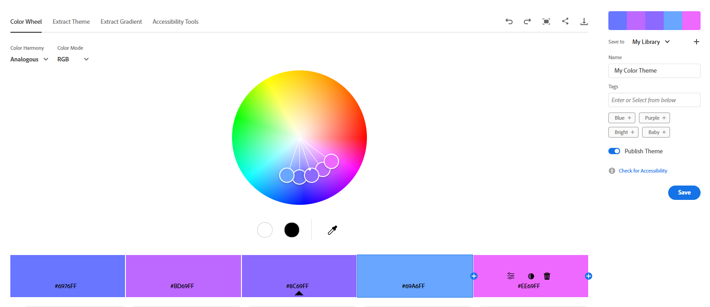

---

- Monochromatic
  - Базовий колір: Індиго (#8C69FF)
  - Логіка: один колір у різних відтінках.
  - Емоційний ефект: мінімалістичність, чистота, структурованість.
  - 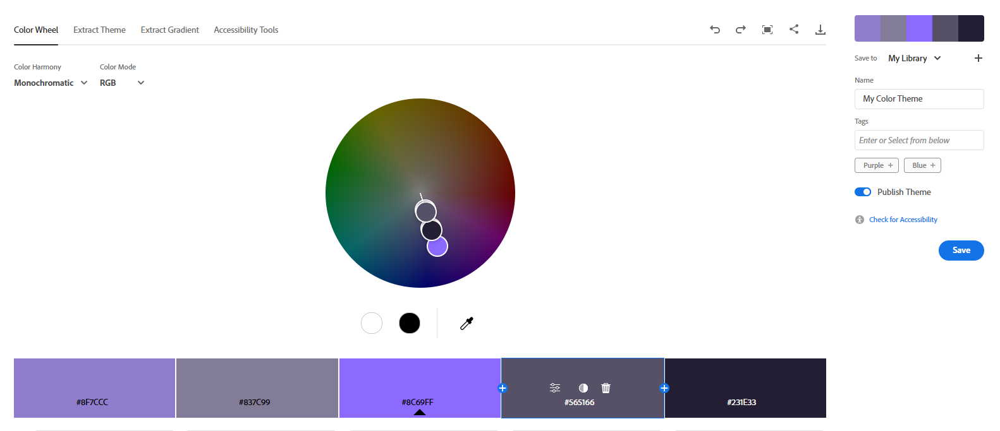

---

- Triad
  - Базовий колір: Індиго (#8C69FF)
  - Логіка: три рівновіддалені кольори на колі.
  - Емоційний ефект: яскравість, динамічність, контрастність.
  - 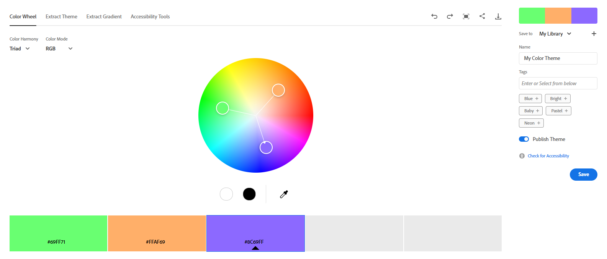

---

- Complementary
  - Базовий колір: Індиго (#8C69FF)
  - Логіка: поєднання протилежних кольорів.
  - Емоційний ефект: сильний контраст, добре для акцентів.
  - 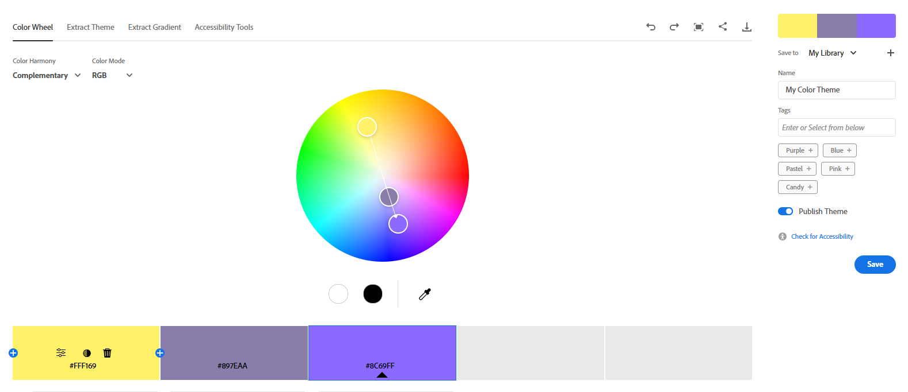

---

- Split Complementary
  - Базовий колір: Індиго (#8B69FF)
  - Логіка: базовий колір + два кольори по боках від комплементарного.
  - Емоційний ефект: контрастний, але більш збалансований, ніж complementary.
  - 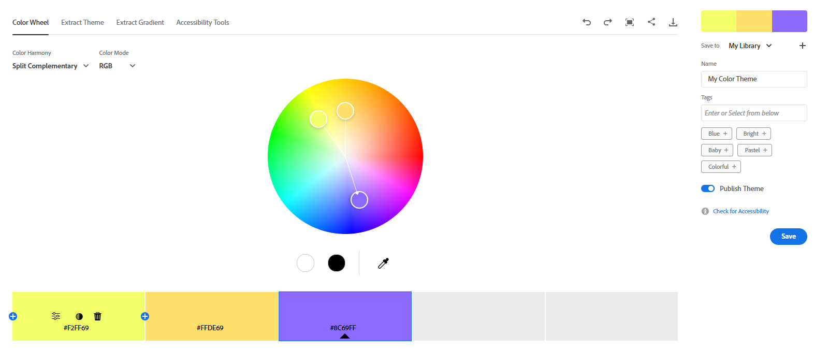

---

- Square
  - Базовий колір: Індиго (#8B69FF)
  - Логіка: чотири рівновіддалені кольори формують квадрат.
  - Емоційний ефект: насиченість, універсальність, багато акцентів.
  - 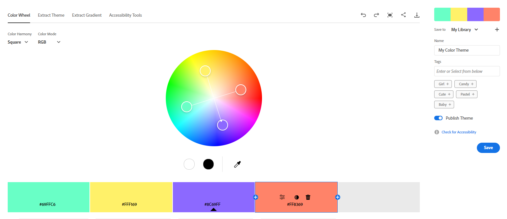

---

- Custom
  - Базовий колір: Індиго (#8B69FF)
  - Логіка: індивідуально підібрана палітра.
  - Емоційний ефект: унікальний стиль під конкретний настрій або бренд.
  - 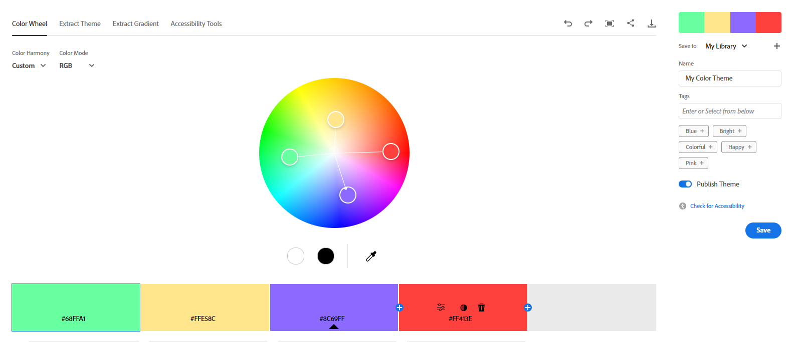

---

3. Для кожної палітри:

   - Зафіксуйте скріншот.
   - Підпишіть тип гармонії.
   - Вкажіть базовий колір.
   - Коротко опишіть логіку побудови і передбачуваний емоційний ефект.

   - Analogous: Базовий колір: Індиго (#8C69FF)
     
   - Monochromatic: Базовий колір: Індиго (#8C69FF)
     
   - Triad: Базовий колір: Індиго (#8C69FF)
     
   - Complementary: Базовий колір: Індиго (#8C69FF)
     
   - Split Complementary: Базовий колір: Індиго (#8B69FF)
     
   - Square: Базовий колір: Індиго (#8B69FF)
     
   - Custom: Базовий колір: Індиго (#8B69FF)
     

II. Створення палітри зображенням (Extract Theme)

4. Завантажте будь-яке зображення у розділ Extract Theme.

   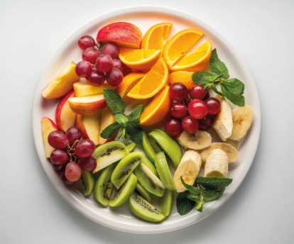

5. Створіть палітру у двох варіантах настрою:

   - Colorful

   - Характеристика: яскраві, насичені кольори.
     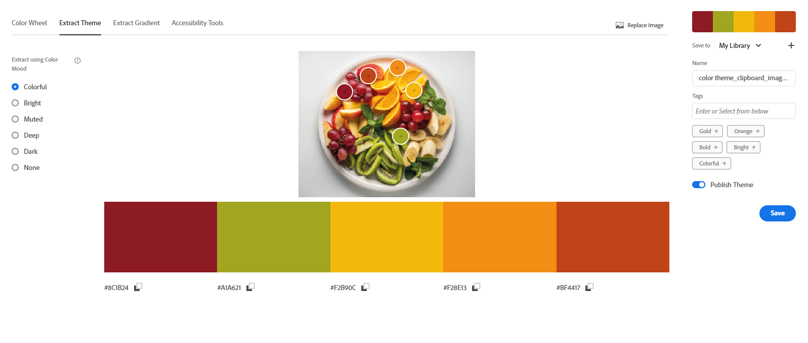

   - Muted

   - Характеристика: приглушені, м’які відтінки.
     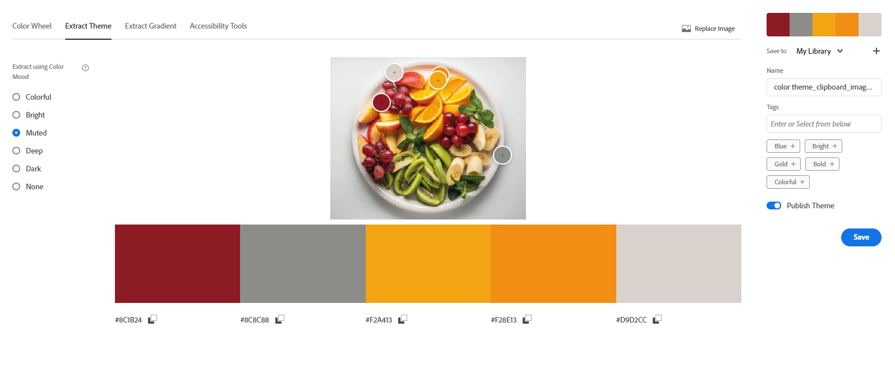

6. Збережіть скріншоти обох варіантів і коротко опишіть:

   - Яка палітра більше підходить для інтерфейсу додатку?
     - Більш доречним є різнокольоровий варіант (Colorful).
   - Чому?
     - Оскільки вихідне зображення містить яскраві фрукти, насичена палітра краще передає настрій та естетику теми, зберігаючи візуальну енергійність.

III. Створення градієнту на основі зображення (Extract Gradient)

7. Завантажте те саме або інше зображення у розділ Extract Gradient.

   

8. Створіть градієнт з трьома кольоровими точками (Gradient Stops = 3).

   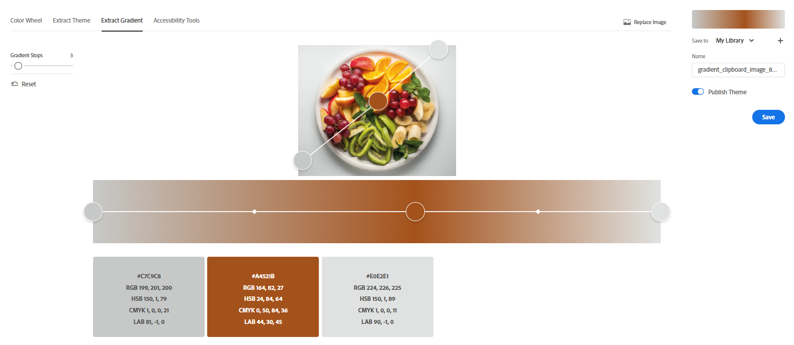

9. Збережіть скріншот побудованого градієнта.

   - Градієнт відображає основні тони зображення, переходячи від теплих фруктових відтінків до більш холодних акцентів фону. Це дозволяє гармонійно використати атмосферу фото в інтерфейсі. (Extract Gradient)

IV. Аналіз контрасту (Accessibility Tools)

10. Використовуючи будь-яку комбінацію кольорів із попередніх палітр:

    - Виберіть одну пару кольорів для тексту та фону.
    - Перевірте контрастність у Accessibility Tools.

11. Зафіксуйте:

    - Рівень контрасту.

      - Приклад недостатнього контрасту: 1.62:1 — Failed
        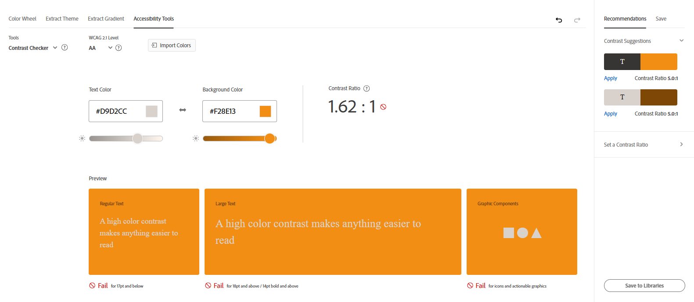

      - Приклад пари, що проходить рівень AA: 6.11:1 (потрібно мінімум 4.5:1)
        

      - Приклад пари, що проходить рівень AAA: 7.75:1 (потрібно мінімум 7:1)
        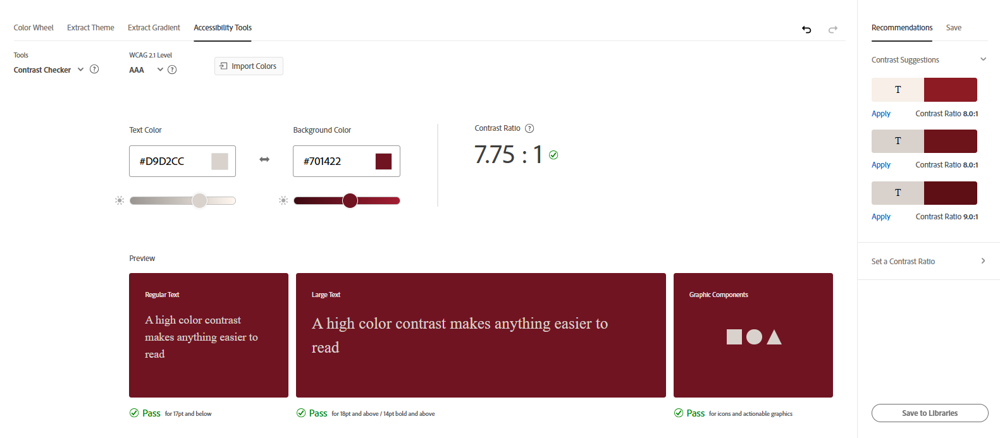

    - Чи проходить ця пара перевірку для звичайного тексту (AA) і великого тексту (AAA). Якщо контраст недостатній — використайте запропоновану корекцію і збережіть скріншот.

      - Пара кольорів проходить/не проходить перевірку для звичайного та великого тексту; у разі недостатнього контрасту була застосована автоматична корекція.

## **Висновки**

- У ході виконання роботи було досліджено основні типи кольорових гармоній та створено палітри за різними принципами, що дозволило глибше зрозуміти закономірності взаємодії кольорів. Було сформовано палітри й градієнти на основі зображень, а також проведено аналіз контрастності відповідно до стандартів WCAG, що дало змогу оцінити доступність вибраних кольорових пар. Отримані результати сприяли формуванню практичних навичок роботи з кольором у дизайні та підвищили здатність обирати візуально збалансовані та доступні рішення для інтерфейсів.
- Дослідження також показало, що для інтерфейсів найкраще підходять гармонії аналогова, комплементарна та монохромна, оскільки вони забезпечують стабільність, читабельність і контрольований контраст, що критично важливо для UX.
