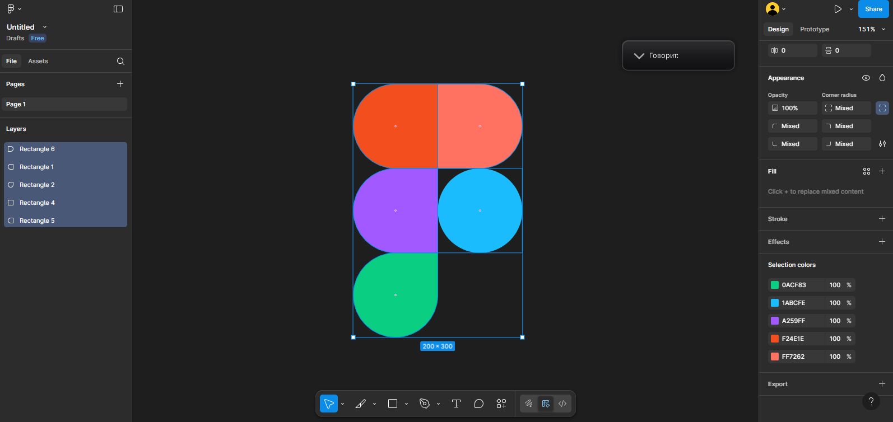

# ПЗ-2: Робота з простими формами та їх властивостями у Figma. Частина 1

## Хід роботи

1. **За керівництвом користувача Figma опрацювати розділи 3–6.**  
   Я ознайомився з розділами 3–6 у керівництві користувача Figma, де описано створення простих форм, їх редагування та зміну властивостей.  
   

2. **Використовуючи просту форму (Shape Tool → Rectangle), створити зображення за прикріпленим зразком.**  
   У новому файлі Figma я вибрав інструмент **Rectangle**, створив кілька прямокутників та відредагував їх розмір і колір відповідно до зразка.  
   

## Висновки

- На практиці я навчився працювати з інструментом **Shape Tool** у Figma.
- Освоїв створення прямокутників та зміну їх властивостей (розміри, колір, обводка).
- Закріпив навички роботи з простими формами, що є основою для створення більш складних прототипів у Figma.
