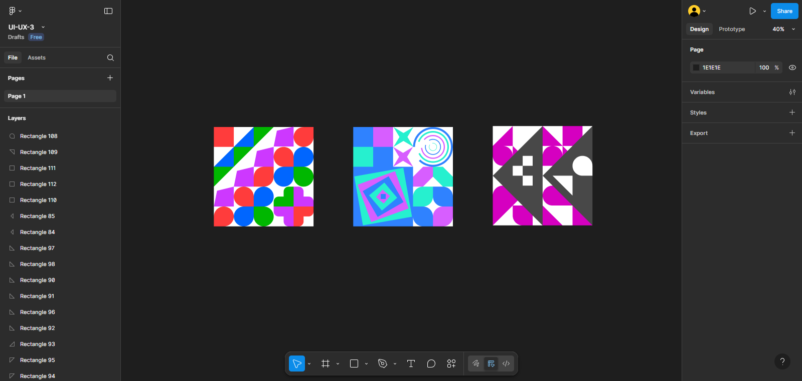
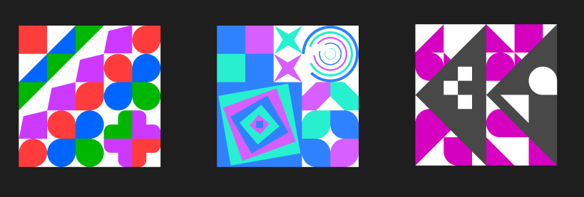

# ПЗ-3 Робота з простими формами та їх властивостями у Figma. Створення геометричного візерунку.Частина 2

## Хід роботи

1. **Опрацювати матеріал розділу 8 за Керівництвом користувача Figma.**  
   Я ознайомився з розділом у керівництві користувача Figma, де описано створення шейпів, їх редагування та зміну властивостей.  
   

2. **Використовуючи прості фігури та їх властивості сервісу Figma створити фрагмент геометричного візерунку.**
   Я створив 3 геометричні візерунки за допомогою інструментів Figma, використовуючи різні форми, кольори та розміри. Було використано інструменти для копіювання, вирівнювання та групування об'єктів. Кольорова палітра була обрана для створення гармонійного вигляду візерунків.
   
   

## Висновки

- На практиці я навчився створювати складніші геометричні візерунки, використовуючи прості форми у Figma.
- Освоїв інструменти для копіювання, вирівнювання та групування об'єктів.
- Закріпив навички роботи з простими формами, що є основою для створення більш складних прототипів у Figma.
- Використав трохи креативності та абстрактного мислення

## Посилання на проєкт

https://www.figma.com/design/qTOkXFImZ055zewQ6EHdPW/UI-UX-3?node-id=0-1&t=6v5OyyntxwKXcZpN-1
