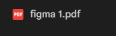
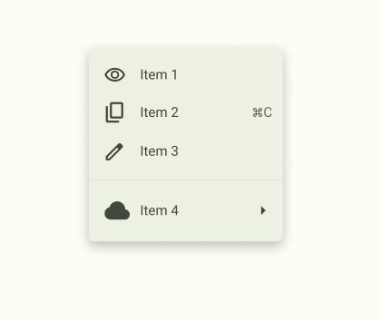

# ПЗ-4 Фрейми, групи і секції у Figma

## **Мета роботи**

Ознайомитися з принципами роботи з фреймами, групами та секціями у Figma. Навчитися створювати складені композиції та інтерфейсні елементи, правильно організовувати структуру проєкту, а також використовувати сучасні інструменти імпорту іконок та роботи з ними.

## **Хід роботи**

1. **Опрацювати матеріал з теми “Фрейми, групи і секції у Figma”.**  
   Я ознайомився з теоретичними матеріалами щодо роботи з фреймами, групами та секціями у Figma. Вивчив, як за допомогою фреймів можна створювати структуру майбутніх макетів, використовувати вкладені елементи, а також керувати розташуванням об’єктів.  
   

2. **Виконання завдання Basic.**  
   Відповідно до завдання, потрібно було повторити у Figma “один в один” заданий елемент дизайну.  
   Я створив макет, використовуючи фрейми для організації структури, згрупував пов’язані елементи та використав секції для логічного поділу об’єктів.  
   

3. **Виконання завдання Medium.**  
   Далі я повторив повноцінний екран інтерфейсу. Було використано фрейми для побудови загального макету, а також групи — для компонентів усередині екрана (текст, кнопки, іконки).  
   Під час роботи застосував вирівнювання, автолейаути, параметри відступів та інтервалів.  
   

4. **Виконання завдання Advanced.**  
   Для складнішого рівня я повторив “один в один” надану іконку.  
   Іконка була побудована з точним дотриманням пропорцій, ліній та розмірів.  
   

5. **Використані ресурси.**
   - **Сайти з безкоштовними іконками:**
     - [https://www.flaticon.com/](https://www.flaticon.com/)
     - [https://www.icons8.com/](https://www.icons8.com/)
     - [https://www.svgrepo.com/](https://www.svgrepo.com/)
     - [https://fonts.google.com/icons](https://fonts.google.com/icons)

## **Висновки**

- Я навчився використовувати **фрейми, групи та секції** для створення логічно структурованих макетів у Figma.
- Освоїв **автолейаути**, **вирівнювання**, **роботу з відступами** та **вкладеними фреймами**.
- Закріпив навички імпорту та редагування іконок за допомогою плагінів.
- Виконав три рівні завдань (Basic, Medium, Advanced), що дозволило повноцінно застосувати отримані знання на практиці.
- Результат роботи відповідає вимогам лабораторної та демонструє розуміння принципів структурування інтерфейсів у Figma.

## **Посилання на Figma-файл з виконанним завданням**

- [https://www.figma.com/design/kCR0apBKN7KfzhXTdxTSRw/UI-UX-4?node-id=0-1&t=PRRvWIatTO68bWov-1](https://www.figma.com/design/kCR0apBKN7KfzhXTdxTSRw/UI-UX-4?node-id=0-1&t=PRRvWIatTO68bWov-1)
