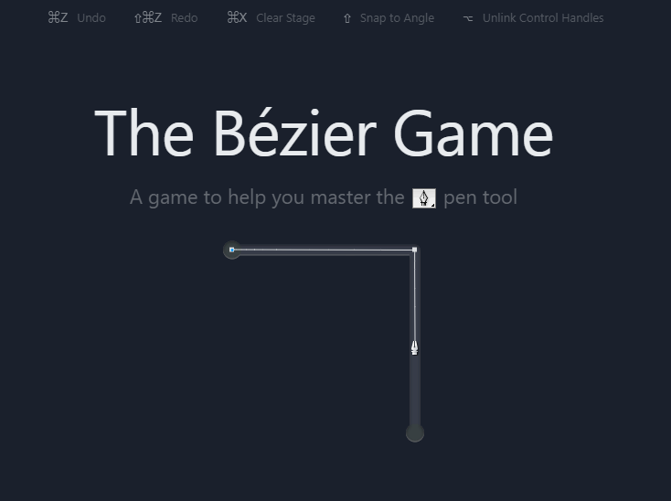
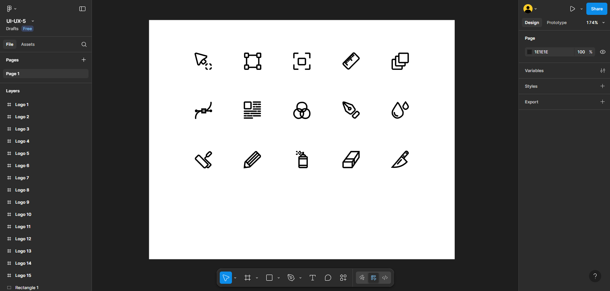

# **ПЗ-5. Криві Безьє, векторні об’єкти у Figma. Створення векторних значків (іконок)**

## **Мета роботи**

Ознайомитися з основами роботи з векторною графікою у Figma, навчитися використовувати інструмент **Pen Tool** для створення кривих Безьє та векторних об’єктів, а також застосовувати знання для побудови власних іконок у стилі **border (обводочному)**.

## **Хід роботи**

1. Опрацьовано матеріал розділів **№9 “Перо”** та **№10 “Векторні мережі”** з "Керівництва користувача Figma".

2. Вивчено принципи побудови кривих Безьє, закріплено навички роботи з інструментом **Pen Tool** за допомогою онлайн-тренажера [The Bezier Game](https://bezier.method.ac/?authuser=0).

3. У Figma створено п’ятнадцять (15) власних іконок у **border-стилі**, кожна розміщена у окремому фреймі розміром **24×24 px**.

4. Для побудови об’єктів використано векторні точки, криві Безьє.

5. Іконки організовано за допомогою **фреймів, груп та секцій** для зручної структури проєкту.

### Приклади виконання:

- **Тренажер з пером:**

  

- **Створені іконки у Figma:**

  

## **Висновки**

У ході виконання роботи я навчився створювати векторні об’єкти у Figma, працювати з кривими Безьє за допомогою Pen Tool, будувати та редагувати контури.
Також було відпрацьовано навички організації об’єктів у фреймах, групах і секціях, що дозволяє створювати структуровані та масштабовані дизайни.
Отримані знання можна застосовувати для створення іконок, логотипів і будь-яких елементів векторної графіки у веб- та мобільних інтерфейсах.

## **Посилання на Figma-файл з виконаним завданням**

[Переглянути Figma-файл](https://www.figma.com/design/Z5QuiqAWqt9GnJXbaG7ca0/UI-UX-5?node-id=0-1&t=dYiL8pXZGyFt5VWM-1)
