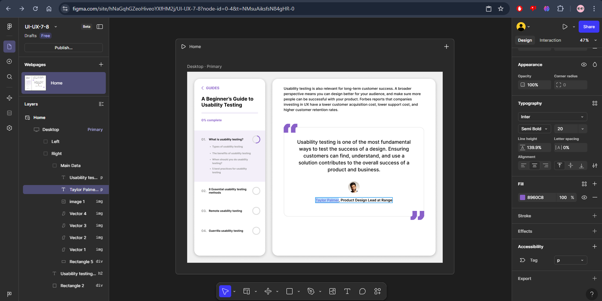

# **ПЗ-7-8 Типографіка в дизайні інтерфейсів**

## **Мета роботи**

Ознайомитися з принципами використання типографіки у дизайні користувацьких інтерфейсів, навчитися підбирати та поєднувати шрифти, налаштовувати інтерліньяж, кегль, контрастність, ієрархію тексту та зручність читання.
Закріпити знання практичним завданням у Figma з правильного розміщення текстових елементів та їх оформлення згідно з правилами візуальної композиції.

## **Хід роботи**

1. **Опрацьовано теоретичний матеріал** із Google-документу
   [Типографіка в дизайні інтерфейсів](https://docs.google.com/document/d/1IAKGCHHd1mB2Ecz_xdSHvbygmMeIOiWp-nQBAQz_JlY/edit?usp=sharing).
2. **Ознайомлено з додатковими ресурсами**:

   - [Ukrfonts — українські шрифти](https://ukrfonts.com/)
   - [Google Fonts](https://fonts.google.com/)
   - [Figma-файл з навчальними прикладами](https://www.figma.com/file/NXddbPnsJQ5ADUwoGdMsKh/Типографія)
   - Відеоматеріал [“Типографіка в дизайні”](https://www.youtube.com/watch?v=EehK2JRDtnQ)
   - Додаткові навчальні файли з Google Drive

3. **Вивчено основні принципи типографіки у UI/UX-дизайні**:

   - Використання **читабельних шрифтів**, оптимальних для веб-інтерфейсів (Sans-serif, Display, Variable Fonts).
   - Побудова **візуальної ієрархії** через кегль, товщину та відстань між рядками.
   - **Контрастність** і роль кольору у сприйнятті тексту.
   - **Сітка, вирівнювання та пропорції тексту** у макеті.

4. **Практичне завдання у Figma (ПЗ-8):**

   - Переглянуто відео [“Типографіка. Частина 2”](https://www.youtube.com/watch?v=VouVsut_-Ak).
   - Виконано вправи із [файлу Figma 3](https://drive.google.com/file/d/12fv8sQYKbUh5xucpRgf9Xvayo7uZKOEh/view?usp=sharing).
   - Створено приклад сторінки з правильно побудованою текстовою структурою: заголовки, підзаголовки, основний текст, навігаційні елементи та підписи.

## **Результат виконання**

На практиці реалізовано сторінку у Figma з використанням основних принципів типографіки.
У роботі застосовано різні стилі тексту для створення акцентів, покращення читабельності та узгодженості елементів інтерфейсу.

## **Висновки**

У результаті виконання ПЗ-7-8 було:

- засвоєно основні принципи типографіки у дизайні інтерфейсів;
- вивчено поняття кеглю, інтерліньяжу, трекінгу та вирівнювання тексту;
- навчено створювати текстову ієрархію та підбирати гармонійні пари шрифтів;
- виконано практичне завдання у Figma, що демонструє застосування типографічних правил у створенні користувацького інтерфейсу.

## **Посилання на Figma-файл з виконаним завданням**

[Переглянути Figma-файл із роботою](https://www.figma.com/site/hNaGqhGZeoHiveoYXfHM2j/UI-UX-7-8?node-id=0-4&t=NMsuAiksfsN84gHR-0)
