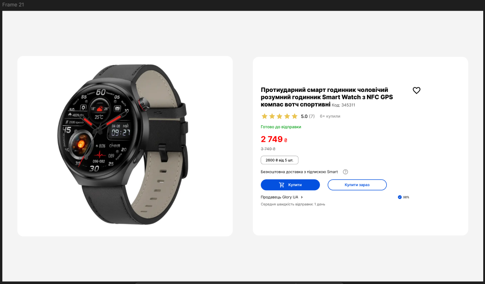
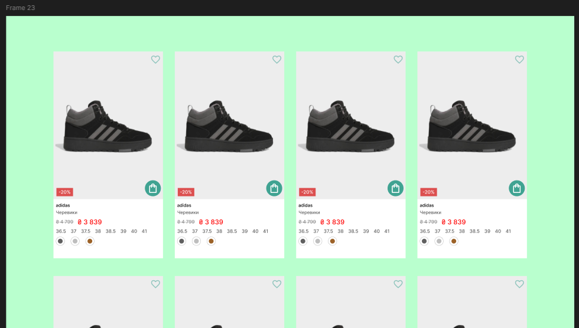

# ПЗ-9 Функція Auto layout у Figma. Створення картки товару (послуги)

## **Мета роботи**

Метою даної роботи є навчитися створювати картки товарів з використанням функції **Auto layout** у Figma, що включає:

- Роботу з текстом і зображеннями
- Використання значків (іконок)
- Налаштування відступів, spacing, align та інших властивостей Auto layout
- Використання плагінів для швидкого імпорту зображень і іконок

---

## **Хід роботи**

### **1. Підготовка Figma-файлу**

1. Створено новий файл у Figma: `File → New File` або гаряча клавіша **Ctrl+N**
2. Підготували робочу область: (Page 1 - Page 3) Frame (**F**)
3. Встановлено плагіни:
   - **Unsplash** – імпорт зображень
   - **Feather Icons** та **Iconsax 6000+** – для іконок
   - **Remove BG** – видалення фону з зображень

---

### **2. Створення картки №1: Годинник**

**Кроки:**

1. Створили фрейм для картки: **Frame → F**
2. Встановили **Auto layout** (**Shift+A**) (Hug, Fill)
3. Додали зображення годинника через плагін **Unsplash**
   - Розмір зображення: 360x360 px
4. Додали текстові блоки (**T**)
5. Додали іконки для кнопок через **Feather Icons**

**Картка годинника:**

**Гаряча клавіша:**

- **Shift+A** – Auto layout
- **Ctrl+D** – Duplicate
- **Ctrl+G** – Group
- **Ctrl+Shift+] / Ctrl+Shift+[** – Bring forward / backward

---

### **3. Створення картки №2: Кросівки**

**Кроки:**

1. Фрейм (**F**)
2. Auto layout (**Shift+A**)
3. Додали зображення кросівок через Unsplash, розмір 250x250 px
4. Додали текст:
5. Додали іконки: `Додати в кошик` (shopping-cart), рейтинг (зірочки)

**Картка кросівок:**

**Гаряча клавіша:**

- **T** – Text
- **Shift+A** – Auto layout
- **Alt+Drag** – Duplicate elements

---

### **4. Створення картки №3: iPhone**

**Кроки:**

1. Фрейм (**F**)
2. Auto layout (**Shift+A**)
3. Додали зображення iPhone через Unsplash або Freepik
4. Додали текст:
5. Додали іконки: `Додати в кошик` (shopping-cart), `Улюблене` (heart), рейтинг (stars)

**Картка iPhone:**

**Гаряча клавіша:**

- **Ctrl+G** – Group
- **Shift+A** – Auto layout
- **Ctrl+Shift+K** – Show/hide layout grids
- **Ctrl+Alt+Shift+A** - Auto layout + auto framing

---

## **Результат виконання**

- Створено 3 картки товарів: годинник, кросівки, iPhone
- Використано Auto layout для зручного та адаптивного розташування елементів
- Додані зображення та іконки через плагіни Unsplash та Feather Icons
- Картки готові для інтеграції у макет сайту або мобільного додатку

---

## **Висновки**

У результаті виконання ПЗ-9 було досягнуто наступного:

- **Ознайомлено з функцією Auto layout у Figma**  
  Було детально вивчено принципи роботи Auto layout: вертикальна та горизонтальна орієнтація, вирівнювання елементів, відступи (padding) та проміжки між елементами (spacing). Це дозволяє створювати адаптивні макети без необхідності ручного підгонки кожного елемента.

- **Навченося швидко створювати картки товарів із зображеннями та текстом**  
  Практичне завдання допомогло зрозуміти, як комбінувати зображення, заголовки, описи та ціни в одній структурі. Застосування Auto layout дозволило економити час і уникати помилок при зміні розмірів карток.

- **Використано плагіни для імпорту зображень і іконок**  
  Завдяки плагінам Unsplash, Feather Icons та Iconsax створення графічної частини картки стало значно простішим та швидшим. Remove BG дозволив автоматично видаляти фон з зображень, що покращило загальний вигляд карток.

- **Отримано практичні навички управління відступами, spacing, alignment та ефектами**  
  Було застосовано різні значення padding та spacing, вирівнювання тексту та іконок по центру. Це дозволяє робити інтерфейс більш естетичним та зручним для користувача.

- **Розуміння структури та організації фреймів у Figma**  
  Кожна картка має чітку структуру: Image → Title → Description → Price → Icons. Це спрощує подальшу роботу над дизайном та полегшує внесення змін.

- **Підготовка до реальної розробки веб- та мобільних інтерфейсів**  
  Отримані навички можна застосувати при створенні адаптивних карток продуктів для сайтів та додатків, що значно підвищує ефективність дизайнера у роботі над UI/UX проєктами.

- **Підготовка до реальної розробки веб- та мобільних інтерфейсів**  
  Отриманий досвід дозволяє легше переносити дизайн у код, розуміючи, як елементи будуть взаємодіяти у веб-середовищі.

## **Посилання на Figma-файли з виконаними завданнями**

- [Переглянути Figma-файл із роботою 1](https://www.figma.com/design/m5Ak1udbPSh3zjh6zB8ojN/UI-UX-9?node-id=0-1&p=f&t=4IkPGzJVS0PP5teL-0)
  
- [Переглянути Figma-файл із роботою 2](https://www.figma.com/design/m5Ak1udbPSh3zjh6zB8ojN/UI-UX-9?node-id=62-4&p=f&t=4IkPGzJVS0PP5teL-0)
  
- [Переглянути Figma-файл із роботою 3](https://www.figma.com/design/m5Ak1udbPSh3zjh6zB8ojN/UI-UX-9?node-id=64-500&p=f&t=4IkPGzJVS0PP5teL-0)
  
